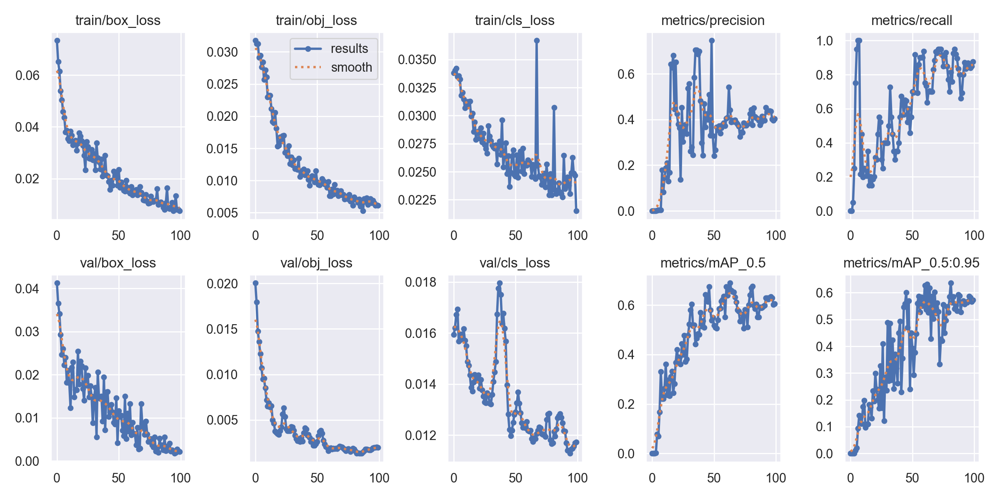

# YOLOv5-Hybrid-analysis-based-on-the-above-two-features

## 第一步
把從封包提取的灰階圖透明度降低50%後，蓋在API產生的圖片上
```
input 1
input 2
python code/image_cover.py
output image
```


## 第二步
把圖片統一大小成640*640
```
input image
python code/resize.py
output image1
```

## 第三步
用yolov5訓練分類
```
input train
input yaml.yaml
python yolo.py
```

3-1以下是訓練出來的結果


